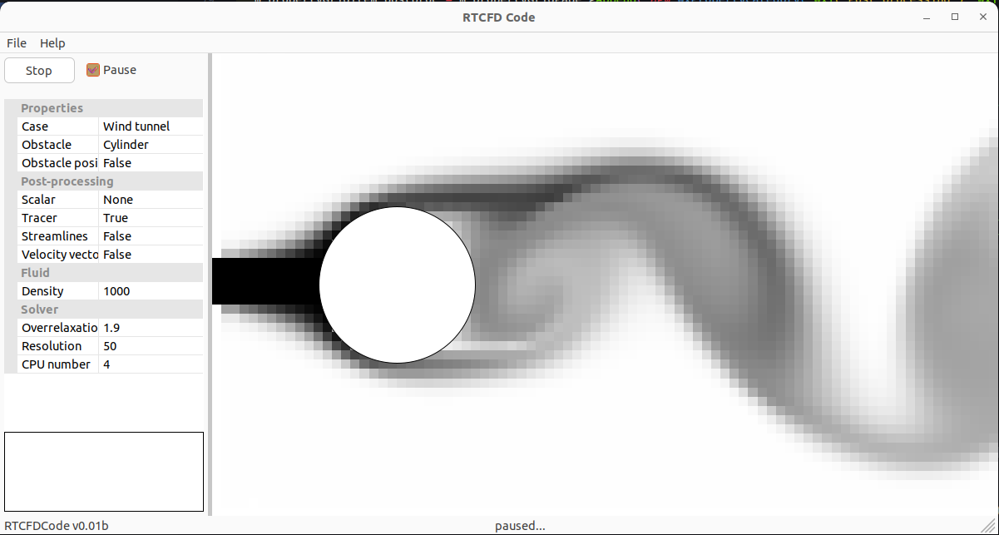
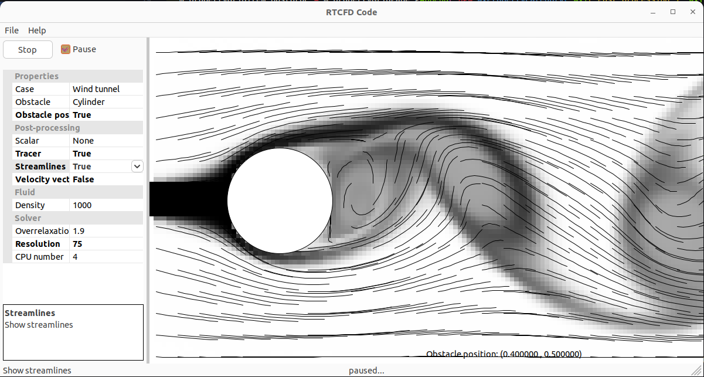
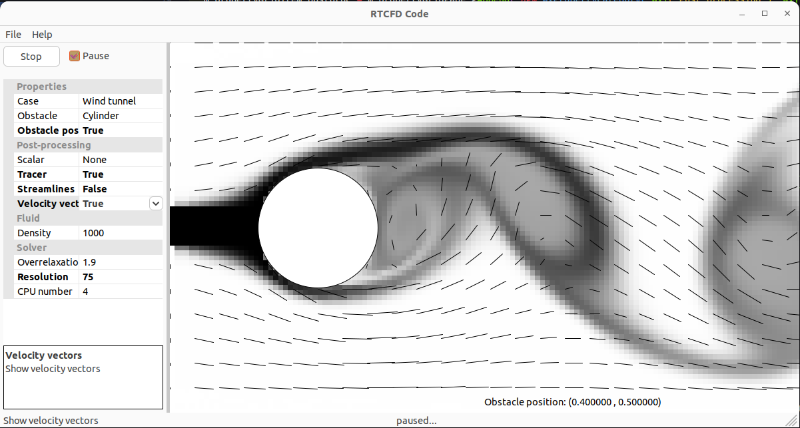
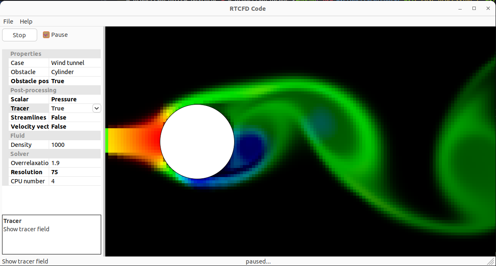
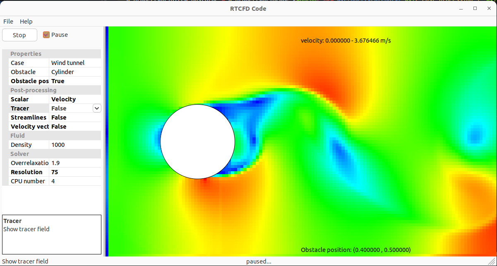
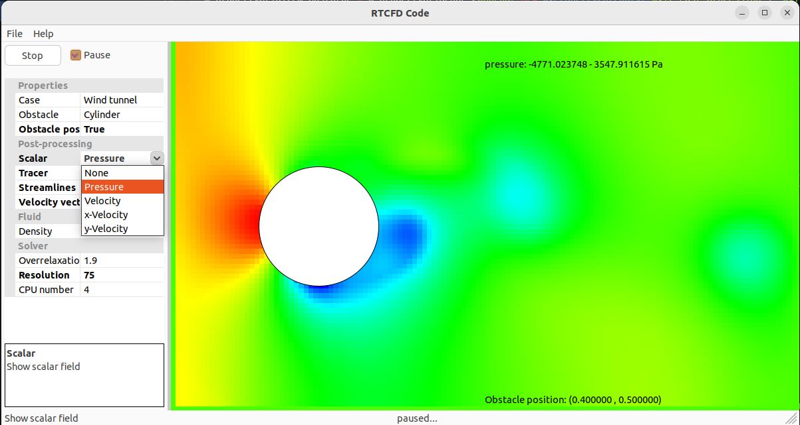

# Real-time Computational Fluid Dynamics

This repository presents a real-time CFD solver based on a "rough" representation of conservation equations. The solver is implemented in **C/C++** for **real-time** purpose and **wxWidget** for the user interface and graphical renderings. It supports a wide range of features:
- 2D problems (3D in progress)
- real-time flow patern variation
- variety of obstacles (in progress)
- drag-and-drop obstacles
- postprocessing using: scalars (pressure, velocity, tracer), streamlines and velocity vectors

## Getting Started
 	
### Prerequisites

First, make sure the following libraries are installed. Mainly

- wxWidgets
- OpenMP


### Install an build
#### 1. Using cmake (command-line)
```
git clone https://github.com/skhelladi/wxRTCFD_Code.git
cd wxRTCFD_Code
mkdir build
cd build
cmake .. -DCMAKE_BUILD_TYPE=Release
make -j
```

#### 2. Using CodeBlocks
```
git clone https://github.com/skhelladi/wxRTCFD_Code.git
cd wxRTCFD_Code 
codeblocks wxRTCFD_Code.cbp
```
then build.

#### 3. Using Visual Studio Code 
```
git clone https://github.com/skhelladi/wxRTCFD_Code.git
cd wxRTCFD_Code
code .
```
then build.

### Run the code
Execute wxRTCFD_Code binary file in build directory.


## Screenshots
________________________
     
  
 
_______________________

<!-- ## Tutorial -->

<!-- [](https://www.youtube.com/watch?v=gvOE69KHmwU) -->

## License
This project is licensed under the GPL-3 license.

Unless you explicitly state otherwise, any contribution intentionally submitted by you for inclusion in this project shall be licensed as above, without any additional terms or conditions.

## Authors
- Sofiane KHELLADI


### Code inspiration
This code is based on the theoretical developments and javascript code presented by Matthias Müller in "Ten Minute Physics" channel.

Link: https://matthias-research.github.io/pages/tenMinutePhysics/17-fluidSim.pdf

and the Qt version of the same code developed by Sofiane KHELLADI

Link: https://github.com/skhelladi/RTCFD_Code